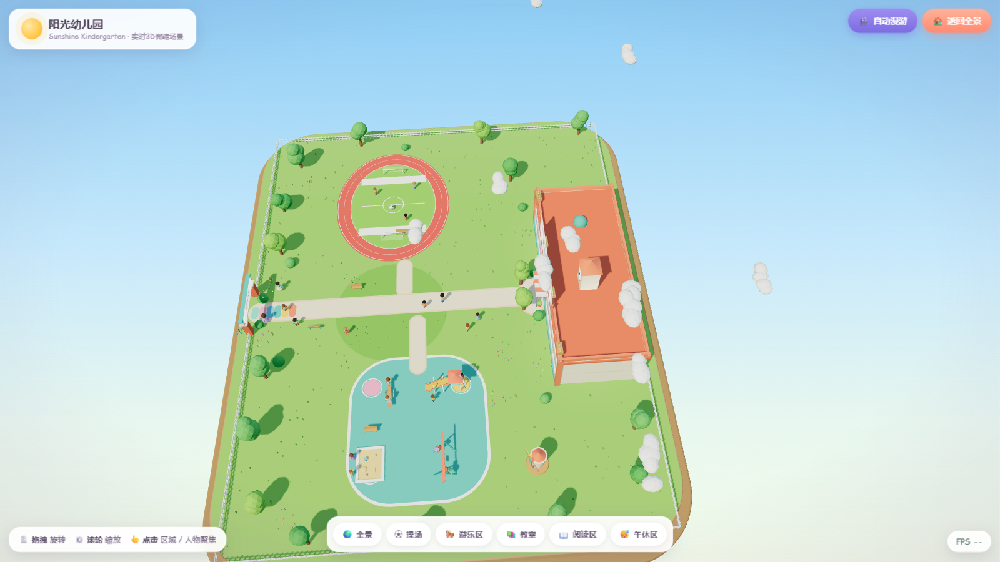

# 🌞 阳光幼儿园 · Sunshine Kindergarten — 实时3D微缩幼儿园 Demo



基于 **Three.js (WebGL)** 的可交互实时渲染 Web3D 场景：一座「活着的」低多边形卡通微缩幼儿园。
纯前端实现，无构建步骤、无外部依赖（Three.js 已本地化），双击即可运行。

上图为本 Demo 实际运行画面（默认 3/4 俯视等距全景视角，Chrome 运行时截取）。

## 🚀 运行方式

**方式一（最简单）：双击打开单文件版**

直接双击项目根目录的 **`index-双击打开.html`** —— 所有代码已打包内联为单文件，无需任何服务器，Chrome/Edge 双击即玩。

**方式二：本地服务器**（开发/修改源码用）

任意静态服务器皆可（ES Modules 需要 http 协议，直接双击 index.html 会因 file:// CORS 限制无法运行）：

```bash
# 方式一：Node（推荐，自带禁缓存，改代码刷新即生效）
node serve.mjs

# 方式二：Python
python -m http.server 8080
```

然后浏览器打开 <http://localhost:8080>（推荐 Chrome / Edge 最新版）。

## 📦 如何生成 `index-双击打开.html`（单文件版）

`index-双击打开.html` 是把 `index.html` + `src/` 全部模块 + 本地 `lib/three.module.js` 用 [esbuild](https://esbuild.github.io/) 打包并内联后的产物，双击即可离线运行。修改 `src/` 源码后，按以下三步重新生成（需要 Node.js；`npx` 会自动临时下载 esbuild，无需在项目里安装任何依赖）：

```bash
# 1) 打包 src/main.js 及其全部依赖（importmap 中的 three 通过 alias 指向本地 lib/three.module.js）
npx esbuild src/main.js --bundle --format=iife --outfile=.bundle.tmp.js \
  --alias:three=./lib/three.module.js --charset=utf8

# 2) 用打包产物替换 index.html 末尾的 importmap + module 两个 <script> 标签，写出单文件版
node -e '
const fs = require("fs");
let html = fs.readFileSync("index.html", "utf8");
const bundle = fs.readFileSync(".bundle.tmp.js", "utf8");
const re = /<script type="importmap">[\s\S]*?<\/script>\s*<script type="module" src="\.\/src\/main\.js"><\/script>/;
if (!re.test(html)) { console.error("script tags not found in index.html"); process.exit(1); }
html = html.replace(re, () => "<script>\n" + bundle + "\n</script>");
fs.writeFileSync("index-双击打开.html", html);
console.log("index-双击打开.html 已生成");
'

# 3) 删除临时打包文件
rm .bundle.tmp.js
```

生成后双击 `index-双击打开.html` 即可验证，全程无需服务器。

## ✨ 场景内容

- **主楼**：2 层奶油色教学楼，中英双语招牌「阳光幼儿园 SUNSHINE KINDERGARTEN」、楼顶时钟塔（走动的指针）、彩虹层间饰带；南立面大面积玻璃窗，可透视教室（黑板/圆桌/画画与举手的小朋友/老师）、阅读区（彩色书架/坐垫看书）、二层午休区（小床/躺睡小孩/Zzz 梦泡）
- **户外园区**：草坪、塑胶操场、环形跑道（白分道线）、小足球场（球门/角旗/可被踢动的足球）、滑梯（排队→爬梯→滑下循环）、秋千（3 座自主摆动）、跷跷板（自动起伏）、沙坑（挖沙玩具）、风车（旋转）、花草树木（随风摆动）、长椅、白栅栏、校门（双语门楣+彩旗）
- **人物**：25 名卡通儿童 + 3 名老师，全部程序化动画（待机/行走/奔跑/静坐/挥手/交谈/跳跃/荡秋千/滑梯/踢球/挖沙/画画/举手/阅读/午睡…），动作相位随机错开
- **环境动画**：云朵漂移、小鸟间歇飞过、蝴蝶飞舞、草木摇摆、时钟转动

## 🎮 交互

| 操作 | 效果 |
|---|---|
| 鼠标拖拽 | 旋转视角（右键/Shift+拖拽平移） |
| 滚轮 / 双指 | 缩放 |
| 悬停人物/区域 | 显示无隐私信息标签（昵称 + 活动，中英双语） |
| 点击小朋友 | 镜头平滑拉近跟随观察 |
| 底部区域按钮 / 点击场景热点 | 全景 / 操场 / 游乐区 / 教室 / 阅读区 / 午休区 平滑聚焦 |
| 🎬 自动漫游 | 按 全景→操场→游乐区→教室→阅读区 循环巡航，任意拖拽自动打断 |
| 🏠 返回全景 | 回到默认 3/4 俯视全景 |

## ⚡ 性能

- 实例化渲染（树冠/花/草/栅栏/彩旗）+ 几何/材质缓存共享
- 单级柔和阴影（PCFSoft 2048）+ 人物 LOD（远距隐藏面部细节）
- RAF 主循环 + 帧率自适应降级（低帧时自动降低 pixelRatio）
- 右下角实时 FPS 显示；桌面浏览器可稳定 45–60 FPS

## 📁 结构

```
index.html          入口 + UI（加载动画/标签/按钮）
index-双击打开.html  单文件离线版（esbuild 打包内联，见上文生成步骤）
lib/three.module.js Three.js r160（本地）
docs/               截图
src/
  main.js           启动流程 + RAF 主循环
  setup.js          渲染器/相机/灯光
  camera-manager.js 轨道相机 + 区域聚焦 + 自动漫游
  ground.js         微缩基座/小径/塑胶地垫
  building.js       主楼 + 室内家具 + 时钟塔 + 招牌
  sports.js         环形跑道 + 足球场 + 球门 + 足球
  playground.js     滑梯/秋千/跷跷板/沙坑/风车
  nature.js         树木/花草/围栏/校门/云/鸟/蝴蝶
  character.js      人物工厂 + 姿势动画库（16 种姿势）
  behaviors.js      行为状态机（11 类群体行为）
  interaction.js    射线拾取 + 悬停标签 + 点击聚焦
  ui.js             界面接线
```

## 🤖 开发方式

本项目由 **ZCode**（AI 编程智能体）使用 **GLM-5.2 max** 模型开发完成 —— 从下面这条源提示词出发，一键生成全部场景代码并调试至可运行状态。**Co-Author: ZCode**。

<details>
<summary>📖 点击展开：源提示词</summary>

> 基于Three.js+WebGL开发可在现代浏览器直接运行的实时3D动态幼儿园网页Demo，为可交互实时渲染Web3D场景，非静态图与预渲染视频，整体采用高质量低多边形卡通微缩画风，造型圆润柔和、光照明亮自然、阴影柔和、材质干净清新，贴合儿童动画质感，无写实风格与廉价Demo质感，打造真实运转的迷你童趣幼儿园场景。场景包含2-3层带彩色装饰与中英文标识的幼儿园主楼，大面积玻璃窗可展示室内桌椅与课堂活动，户外搭建精致微缩园区，涵盖草坪、塑胶操场、环形跑道、小型足球场、滑梯、秋千、跷跷板、沙坑、花草树木、长椅、围栏与校门，整体布局紧凑，单视角可预览大部分园区。场景内置15至25名卡通儿童及2至4名卡通老师，全员配备待机、行走、奔跑、静坐、玩耍、挥手、交谈、跳跃等基础动画，人物动作时间错开、互不重复，随机实现荡秋千、滑滑梯、踢球、沙坑玩耍、追逐跑动、草坪闲聊、师生散步、室内学习、举手答题、绘画阅读等多样动态行为。场景搭载自然舒缓的全局环境动画，包含草木随风摆动、云朵缓慢平移、秋千跷跷板自主运动、风车旋转、足球微动、小鸟间歇飞过、室内人物小幅活动，动态细腻不杂乱。镜头默认采用四分之三俯视等距视角，支持鼠标拖拽旋转、滚轮缩放，可点击操场、游乐区、教室、阅读区、午休区实现镜头平滑过渡聚焦，新增自动漫游功能，可按全景、操场、游乐区、教室、阅读区的路径自动循环巡航。交互上支持人物悬停与点击展示户外活动、绘画阅读、体育活动等无隐私信息标签，点击单个小朋友可让镜头平滑拉近观察，支持返回全景。项目纯前端实现，兼容Chrome、Edge浏览器，支持屏幕自适应，通过轻量化建模、实例化渲染、LOD层级优化、合理阴影配置与RAF动画机制保障流畅帧率，自带加载动画与平滑入场效果，全程规避穿模、人物漂浮、动作同步僵硬、镜头穿墙等问题，优先完成高视觉质量MVP，重点优化场景质感、园区布局、人物动态、镜头交互、环境动画与性能适配，呈现阳光清新、全程动态鲜活的真实幼儿园微缩场景效果。

</details>

## 📄 开源协议

[MIT License](./LICENSE) © 2026 johnfu-ai
